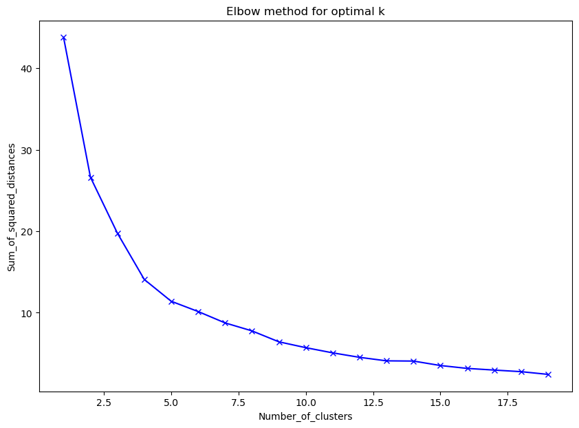

# Behavioral Data Clustering and Gender Correlation Analysis

## Project Overview

This project focuses on analyzing and clustering a dataset based on daily behaviors to investigate the relationship between these behaviors and gender classification. The primary goal is to cluster the data into two groups initially without considering the gender column and then evaluate whether the clustering aligns with the gender classification of the data. The project employs the K-Means algorithm for clustering and assesses the results using silhouette score and Davies-Bouldin score criteria.

### Problem Statement

The challenge lies in determining the consistency of clustering with the gender classification and evaluating the clustering quality. The project also explores the optimal number of clusters using the elbow method for the K-Means algorithm and re-evaluates the clustering with the new cluster count.

### Desired Outcomes

The project involves the following key steps:

1. **Data Analysis and Pre-processing:** Initial exploration and preparation of the data for clustering.
2. **Clustering Model Development:** Implementing the K-Means algorithm for data clustering.
3. **Evaluation of Clustering:** Assessing the clustering results using silhouette score and Davies-Bouldin score.
4. **Optimization of Cluster Count:** Determining the optimal number of clusters and re-evaluating the clustering.
5. **Detailed Documentation:** Each step, including the rationale and results, is thoroughly documented in a PDF file.

## Repository Structure

- `HW2-2.ipynb`: Jupyter notebook containing the entire analysis and clustering process.
- `Q2.csv`: The dataset used for the analysis.
- `Report.pdf`: A PDF file containing a detailed report of the analysis, results, and evaluations.

## Key Results

- The notebook includes a diagram comparing the clustering results with the actual gender classification of the data, highlighting the accuracy and effectiveness of the clustering.

  
  
- Detailed evaluation of the clustering results using silhouette score and Davies-Bouldin score.
- Discussion on the optimal number of clusters and the re-evaluation of the clustering with this new cluster count.

  

## How to Use

- Clone the repository.
- Ensure you have Jupyter Notebook installed along with required libraries: Numpy, pandas, matplotlib, seaborn, plotly, sklearn.
- Run `HW2-2.ipynb` to view the analysis and results.
